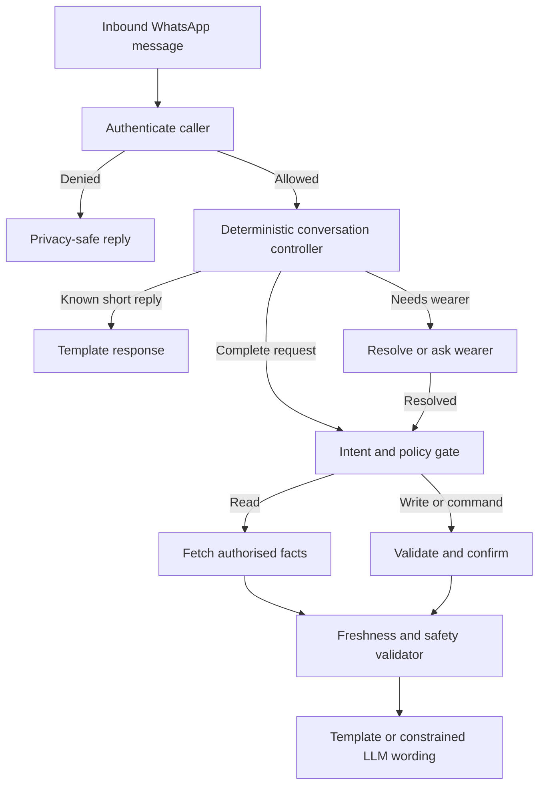

# Guardian WhatsApp Conversation Architecture

**Status:** Engineering contract — Phase 1 foundation  
**Last updated:** 14 August 2026  
**Applies to:** Guardian Family and Guardian Care WhatsApp features  
**Does not apply to:** Guardian Essential (Rs 199/month renewal), which has no WhatsApp capability

## 1. Purpose

Guardian WhatsApp is a safety interface, not a general-purpose chatbot. It must give authorised family members clear, factual answers about linked wearers while protecting private data and never implying that an emergency action occurred when it did not.

The core product rule is:

> Deterministic code decides identity, permission, intent routing, device selection, freshness, safety wording, confirmation, and whether an action may occur. The language model may phrase or summarise approved facts, but it may not create facts, permissions, actions, or safety outcomes.

## 2. Non-negotiable invariants

1. **Fail closed.** Unknown callers, unknown roles, unlinked devices, missing records, and ambiguous permissions receive no private wearer data.
2. **Direct registration wins.** If a number is both a registered Guardian user and an emergency contact, its direct user record is authoritative.
3. **Emergency contacts are notification-only.** Being listed as an emergency contact does not grant location, battery, history, alerts, reminders, or command access in chat.
4. **Only linked devices are visible.** Every data query and command is constrained to the authenticated caller's own `linkedImeis`.
5. **No invented telemetry.** Battery, online state, location, alert, journey, and reminder answers must come from accepted backend records.
6. **Freshness is explicit.** Stale or absent data is labelled; it is never presented as current.
7. **No false emergency claims.** WhatsApp chat must never claim that Guardian contacted, dispatched, or notified emergency services unless a separately verified integration has done so and provides a durable receipt.
8. **Commands require policy checks.** A model cannot directly execute an action. The deterministic command layer validates permission, target, parameters, confirmation, idempotency, and outcome.
9. **Ambiguity pauses execution.** If more than one wearer could match, Guardian asks a specific question and stores only the pending intent.
10. **Every sensitive decision is auditable.** Authentication, selected wearer, policy result, data timestamps, tools used, confirmation, and final response class are logged without storing unnecessary message content.

## 3. Reply pipeline



The order is security-sensitive. Authentication happens before conversational convenience. Conversation memory never widens caller scope. The final validator runs after tool execution so unsafe language or unsupported claims cannot escape through either a template or a model.

## 4. Three response levels

| Level | Used for | Implementation | LLM allowed? |
|---|---|---|---|
| A — Exact deterministic | greetings, thanks, help, cancellation, privacy denial, missing wearer, confirmations, emergency boundaries, errors | reviewed templates | No |
| B — Deterministic data rendering | battery, online state, location link, recent alerts, reminder receipt, command receipt | code builds response from typed facts and timestamps | Normally no |
| C — Constrained natural language | summaries, explanations, multi-event journey narratives, wellbeing summaries | model receives only authorised structured facts and a response contract | Yes, with validation |

Level A and B should handle common WhatsApp traffic. This reduces latency and model cost while making behaviour testable. Level C is for synthesis, not basic routing.

## 5. Conversation state

Phase 1 keeps short-lived state per normalised sender number:

```json
{
  "pendingIntent": "LOCATION_REQUEST",
  "lastIntent": "LOCATION_REQUEST",
  "lastWearerImei": "authorised-linked-imei",
  "expiresAt": "server timestamp"
}
```

Rules:

- Default expiry is 30 minutes.
- State may contain an IMEI only after it has been verified against the current caller's `linkedImeis`.
- State is revalidated against current permissions on every message; it is never an authorisation cache.
- `cancel`, `stop`, or `never mind` clears pending state.
- A new explicit wearer overrides the remembered wearer.
- With one linked wearer, Guardian may resolve the wearer automatically.
- With multiple linked wearers and no safe match, Guardian asks which wearer.
- A standalone wearer name completes only an existing pending request; otherwise Guardian asks what the caller wants to know.
- Phase 1's in-process store is suitable for a single gateway instance. Before horizontal production deployment it must be replaced by a shared Firestore or Redis store with server-side TTL and the same interface.

Example:

| Message | Controller decision | Result |
|---|---|---|
| `Location?` | Multiple linked wearers | `Who would you like me to check—Jesh or Mum?` |
| `Jesh` | Completes pending location intent | Execute `Where is Jesh?` within caller scope |
| `Battery?` | Reuse recently selected, still-authorised wearer | Return validated battery reading |
| `Cancel` | Clear pending state | `Okay, cancelled.` |

## 6. Intent contract

| Intent | Required target | Data/action | Default response level |
|---|---:|---|---:|
| `LOCATION_REQUEST` | wearer | latest accepted location and timestamp | B |
| `DEVICE_STATUS` | wearer | battery, connection state, telemetry timestamps | B |
| `RECENT_ALERTS` | wearer | authorised recent alert records | B/C |
| `SAFE_ZONE_CHECK` | wearer | current zone state or configured zones | B |
| `JOURNEY_QUERY` | wearer | accepted journey records | B/C |
| `DAILY_SUMMARY` | wearer plus today/yesterday | aggregate journeys, alerts, safe-zone events and qualified watch status | B |
| `REMINDER_REQUEST` | wearer plus medicine/time/frequency | create or explain reminder | A/B |
| `DEVICE_COMMAND` | wearer plus command | controlled write | A/B |
| `VOICE_MONITOR` | wearer | high-risk command | A/B; explicit policy required |
| `GENERAL_HELP` | none | capabilities only | A |
| `UNCLEAR` | none | one focused clarification | A |

Classifier confidence is not permission. A high-confidence classification can still be rejected by caller scope, target resolution, freshness, or command policy.

## 7. Data freshness contract

Each factual answer uses the source record's event time, ingestion time, and acceptance state. Server receipt time alone does not prove that a reading is live.

| Fact | Fresh | Ageing | Stale behaviour |
|---|---|---|---|
| Battery/status | latest accepted watch telemetry within configured online window | label age | say last reported value and age; do not say “currently” |
| Location | accepted fix with valid coordinates and plausible/corroborated movement | label fix time | provide last known location and age, or state unavailable |
| Alert | durable alert record with event timestamp | show event time | never convert old alert into a new incident |
| Journey | confirmed journey state | identify provisional status if applicable | do not invent arrival, departure, route, or stop |
| Reminder/command | durable write plus identifier | pending status is explicit | never say created/sent/completed without the corresponding receipt |

Freshness thresholds must be central configuration values with boundary tests. UI battery graphics and WhatsApp values may differ temporarily because the watch display estimates locally while Guardian reports the last accepted server telemetry; the answer must disclose the server reading's age.

## 8. Wearer resolution

Resolution order:

1. Exact or unambiguous name/nickname/relationship in the current message.
2. Wearer requested by a pending intent.
3. Last selected wearer, only if still linked and state is unexpired.
4. The only linked wearer, if exactly one exists.
5. Otherwise ask a deterministic clarification.

Names are convenience labels, not security identifiers. After matching a name, the controller uses the authorised device record and IMEI. Duplicate or similar labels must produce a clarification rather than a guess.

## 9. Write actions and confirmation

Reads and writes must be treated differently. Any action capable of changing device behaviour or care configuration follows:

1. Parse the requested action and parameters.
2. Resolve an authorised wearer.
3. Validate the caller role and action-specific policy.
4. Present an exact summary for confirmation when risk or reversibility requires it.
5. Accept an explicit confirmation tied to that pending action and expiry.
6. Write with an idempotency key.
7. Return only the recorded result: queued, acknowledged, failed, or timed out.

The confirmation record must include action type, target IMEI, canonical parameters, initiating caller, creation time, expiry, and a nonce/idempotency key. A bare `yes` without a live matching confirmation cannot trigger an action.

Suggested policy:

| Action | Confirmation |
|---|---|
| Read location/battery/alerts | No |
| Create or change reminder | Yes before persistent write |
| Ring/vibrate watch | Yes unless product explicitly designates it low-risk |
| Delete reminder or change safety configuration | Yes |
| Voice monitoring/listen command | Strong confirmation plus role/legal policy; disabled by default |
| SOS/emergency action | Separate verified product flow; never inferred from ordinary chat |

## 10. Emergency and safety language

Guardian distinguishes information, notification, and dispatch:

- **Information:** Guardian displays a backend fact.
- **Notification:** Guardian records or sends a Guardian alert to configured recipients.
- **Dispatch:** An external emergency service accepts a request and returns a verifiable receipt.

These words are not interchangeable. Until dispatch integration exists, approved wording is:

> Guardian WhatsApp chat does not trigger an SOS or contact emergency services on your behalf. Use the Guardian watch/app SOS flow for Guardian alerts, and contact emergency services directly if immediate help is needed.

Critical requests bypass creative model wording and use reviewed templates. Negative claims are tested as strictly as positive ones: even saying “does not dispatch” can violate a blanket test forbidding the word `dispatch`, so production validators and tests must match the approved phrase contract exactly.

## 11. LLM boundary and cost control

The model receives the minimum authorised context packet:

- caller category and allowed capability labels, not raw permission documents;
- resolved wearer display name and scoped structured facts;
- timestamps and freshness labels;
- only the tools allowed for that caller and intent;
- an explicit response schema and prohibited-claim rules.

It must not receive unrelated family devices, emergency-contact lists, raw audit logs, or unbounded location history.

Cost controls:

- exact courtesy/help replies never call the model;
- simple status/location/alert rendering should not call the model;
- cache static help content, not private dynamic answers;
- cap model/tool turns and response length;
- record model calls, input/output tokens, tool rounds, latency, and fallback reason;
- define a per-plan fair-use policy separately from safety behaviour—cost limits must never weaken privacy checks.

WhatsApp capability is included only in plans that advertise it. Current commercial boundary: Guardian Essential renewal at Rs 199/month has no WhatsApp; Guardian Family at Rs 399/month and Guardian Care at Rs 699/month include the applicable WhatsApp/AI features. First-year watch-inclusive prices are commercial terms and must not be used as backend authorisation flags.

## 12. Error and fallback behaviour

| Failure | User-facing behaviour |
|---|---|
| Unknown/unauthorised caller | privacy-safe registration/access message; no private hints |
| Ambiguous wearer | list only authorised display names and ask one question |
| No telemetry | state that no recent reading is available |
| Stale telemetry | give last reported value plus age, without “currently” |
| Tool timeout | say the check could not be completed; do not reuse an old result silently |
| Model failure | use a deterministic intent-specific fallback |
| Write failure | state failed/not completed; include retry guidance if safe |
| Duplicate webhook | return stored idempotent response; do not repeat tools or charges |

The generic “I’m Guardian…” response is reserved for an actual greeting/help request. It must not be used as the fallback for recognised but incomplete requests.

## 13. Observability and audit

Required metrics:

- requests by intent and plan;
- deterministic versus model-routed percentage;
- clarification and unresolved-wearer rates;
- authentication and policy denials by reason code;
- stale-data responses by fact type;
- model/tool error and fallback rates;
- command confirmation, completion, timeout, and duplicate-suppression rates;
- per-user and aggregate WhatsApp/model cost;
- p50/p95 response latency.

Logs should use request IDs and stable reason codes. Phone numbers, message text, coordinates, medical details, and model payloads must be redacted or omitted unless an explicitly reviewed diagnostic path requires them.

## 14. Test strategy

No conversation feature ships on happy-path tests alone.

### Required test layers

1. **Pure controller tests:** normalisation, deterministic replies, target resolution, expiry, cancellation, and context override.
2. **Permission matrix tests:** direct user, family member, admin, emergency contact, unknown number, unknown role, revoked link, and mixed-role precedence.
3. **Freshness boundary tests:** just inside/outside each time window, missing timestamps, future timestamps, rejected telemetry, reconnect, and stale cache.
4. **Integration tests:** inbound webhook through authentication, tools, validator, idempotency, and outbound reply.
5. **Adversarial tests:** prompt injection, wearer-name collision, attempts to access unlinked devices, confirmation replay, duplicate webhook, and unsafe emergency wording.
6. **Conversation transcript tests:** real multi-turn examples such as `Location?` → `Jesh`, `Battery?`, `Thanks`, `Alerts?`, and `What reminders can I set?`.
7. **Evaluation set:** anonymised production-like utterances in English, French, and Mauritian usage, versioned with expected intent, target, policy result, and factual claims.

### Guardian language corpus

`gateway/test/fixtures/guardian-utterances.json` is the versioned language contract. It contains representative English, French and Mauritian Creole phrases, WhatsApp shorthand, accents, relationships, ambiguity and out-of-scope examples. Every entry declares its expected deterministic intent and optional time period.

The corpus is development-time intelligence: AI may help expand and review it, but production classification runs locally without a model call. New production transcript failures must be generalised into reusable language rules and added to the corpus with neighbouring positive and negative examples. Exact phrase lists alone are insufficient; rules must preserve conflict priority so courtesy language cannot swallow a location request and a daily summary cannot be mistaken for a single alert or journey query.

Initial supported language concepts include location, status/battery, alerts, journeys, daily summaries, safe zones, reminders, commands, critical messages and out-of-scope requests. Corpus coverage and per-intent accuracy are release metrics.

### Release gates

- 100% pass on privacy, permission, emergency-claim, and command-confirmation tests.
- 100% pass on the repository's gateway regression suite.
- No tool may receive an IMEI outside the caller's current authorised set.
- Every status/location response must pass a freshness assertion.
- Duplicate inbound messages execute zero duplicate writes and at most one billable outbound response.
- Shadow traffic shows no increase in incorrect target selection or privacy denials.

## 15. Rollout plan

### Phase 1 — Conversation foundation

- deterministic replies for greetings, acknowledgements, help, reminder help, journey help, and cancellation;
- combined acknowledgements such as `ok thx` remain deterministic but never swallow a functional request containing courtesy language;
- pending wearer clarification and single-wearer/last-wearer resolution;
- plural reminder recognition;
- deterministic journey-history classification, authorised Firestore reads, and factual rendering for `journey?`, `recent journey`, trips, outings, and equivalent past-movement questions;
- suppress journey records diagnosed as likely stationary GPS drift while retaining the underlying data for audit and diagnostics;
- unit tests and existing gateway regression suite.

### Phase 2 — Typed fact renderers

- remove LLM dependence from battery, status, location, and basic alert replies;
- centralise freshness thresholds and fact schemas;
- add transcript-level integration tests and response reason codes.

### Phase 3 — Safe actions

- persistent pending-action records;
- confirmation state machine and idempotent command receipts;
- strict reminder validation and command-specific policy matrix;
- keep high-risk voice monitoring disabled until legal and product approval.

### Phase 4 — Shared conversation state and controlled summaries

- replace process memory with Firestore/Redis TTL state before multiple gateway instances;
- add constrained LLM summaries for journeys and wellbeing;
- add token/cost budgets, evaluation dashboards, and staged plan entitlements.

### Phase 5 — Production hardening

- shadow/canary rollout, red-team scenarios, privacy review, incident runbook;
- monitor clarification, stale-data, fallback, command, latency, and cost metrics;
- expand languages only after each language has deterministic templates and its own evaluation set.

## 16. Definition of done

A Guardian WhatsApp capability is done only when:

- the caller/target/action permission is explicit and tested;
- incomplete and multi-turn messages have deterministic behaviour;
- all factual claims have a source and freshness classification;
- risky actions have confirmation, expiry, idempotency, and durable outcome state;
- emergency wording cannot overstate what occurred;
- model use is optional for core safety facts and cannot override policy;
- logs and metrics can explain the decision without exposing unnecessary private data;
- unit, integration, adversarial, transcript, and regression suites pass;
- rollback is documented and does not corrupt pending state or repeat actions.

This document is the review checklist for future WhatsApp changes. Any exception requires an explicit product, privacy, and engineering decision recorded alongside the code change.
