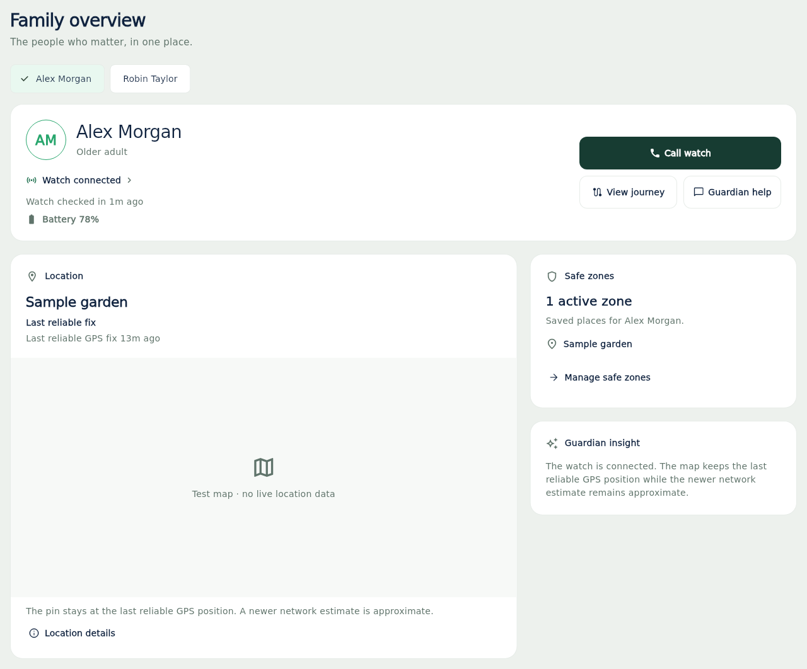

# Dashboard UI refinement

The previous dashboard repeated location, journey and AI information across a
large hero, a row of feature cards and an intelligence panel. The floating dodo
competed with the wearer and watch status. The new overview gives each piece of
information one clear place and uses readable text, quiet surfaces and consistent
spacing.

## Layout

- A compact identity card contains the wearer, watch connectivity, check-in age,
  battery reading and actions. Call watch is the primary action. Connection status
  opens the existing watch-status dialog.
- Location is the main content area. Place, positioning source and fix age sit
  above the map. Location details opens the existing evidence explanation.
- Safe zones list configured places. A saved zone never implies the wearer is
  currently inside it. Manage safe zones opens the existing Safe zones tab.
- Family plans have one Guardian insight. The existing Care summary remains
  gated by the same entitlement. Locked help still opens the entitlement dialog.
- Wide screens show the map beside the supporting cards. Small screens and
  enlarged text use a single column. Navigation retains its existing SOS hold
  interaction, with sufficient scroll clearance below the dashboard.
- Loading, disconnected data and the first-watch empty state have distinct views.

The dashboard does not render the dodo. Existing mascot assets and older shared
widgets remain available to other screens and in-flight branches.

## Rendered review images

These are the actual Flutter overview widgets using synthetic people and a
labelled test map. Production continues to use the existing Google Maps view.



[Phone overview](images/dashboard-overview/mobile.png) ·
[Dark phone overview](images/dashboard-overview/mobile_dark.png)

## Scope and parallel work

Branch: `feat/dashboard-ui-refinement`, based on `main` at `0afd652`.

The two new widgets are presentational. The dashboard page still owns calling,
help, entitlement checks, map controls and journey navigation. This change does
not alter the gateway, Firestore, telemetry, SOS or location selection models.
The platform map has a stable key across responsive rearrangements and camera
updates are guarded against a replaced controller.

PR #116 adds Home Wi-Fi support. Its existing changes to the dashboard page
merge cleanly in a three-way file check against this branch's original base.
The new overview reads `mapDisplayLocation`, `deviceMapLocationFixLabel` and the
page's map status, so its Home Wi-Fi hooks remain relevant. After either branch
moves, repeat integration checks and the Home Wi-Fi widget tests. PRs #119 and
#120 add activity/Care panels to the page's old composition; integrate those
panels deliberately after their service gates are satisfied.

## Verification

`Guardian release gates` runs the existing Flutter analysis, full test suite,
web build, gateway tests and Firestore checks.

`Dashboard UI review` checks formatting, runs the dedicated overview tests and
renders the actual widgets with synthetic data at phone and desktop widths.
Its `guardian-dashboard-previews` artifact contains PNGs. The test map is clearly
labelled and contains no live wearer data, credentials or map service calls.

To reproduce locally from `apps/mobile`:

```sh
flutter pub get --enforce-lockfile
flutter test test/guardian_dashboard_overview_test.dart
flutter test tool/render_dashboard_previews_test.dart --dart-define=DASHBOARD_PREVIEWS=true
```

The image capture tool uses a local font for reproducible offline text rendering.
The production app retains its existing typography. Live Google Maps interaction,
real profile photos and device performance still need normal app playtesting.
