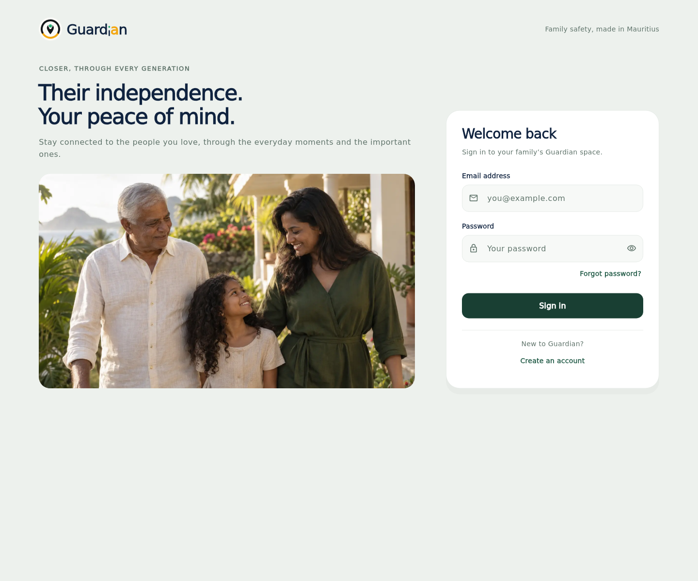

# Guardian welcome and sign-in

The public welcome screen now introduces Guardian through family connection:
“Their independence. Your peace of mind.” The original family photograph gives
the screen a welcoming introduction before sign-in. The image is illustrative,
not a customer testimonial; its generation prompt and provenance are in
[login-image-source.md](login-image-source.md).

## Layout and behavior

- Desktop: Guardian's existing pin and wordmark, headline and family photograph
  beside a focused sign-in form. The photograph and form share a bottom edge,
  with the layout adapting naturally to the form's height.
- Narrow screens and enlarged text: a compact family photograph follows the
  headline, before the form. It is about 150–170px tall on typical phone widths.
  All content scrolls when the keyboard reduces usable space.
- The form follows the selected app theme, with readable field labels, autofill,
  keyboard submission, password visibility controls and 48px minimum actions.
- Registration and password reset use the existing authentication service. New
  accounts still start without linked watches. No plan or watch data is changed.
- Repeated submissions are guarded while a request is pending. Error and reset
  messages are announced, and late requests cannot update a disposed screen.
- The 1536 × 1024 family image is bundled as a roughly 98 KB WebP, requiring no
  remote image host or customer image data.

## Review



[Phone](images/login-welcome/mobile.png) ·
[400 × 730 viewport](images/login-welcome/mobile_viewport.png) ·
[Dark phone](images/login-welcome/mobile_dark.png) ·
[Create account](images/login-welcome/register.png)

The UI workflow runs login behavior/layout tests and captures the real login and
registration widgets with fake authentication. The captures use local fonts for
offline reproducibility; production keeps Guardian's existing typography.

From `apps/mobile`:

```sh
flutter pub get --enforce-lockfile
flutter test test/login_page_test.dart
flutter test tool/render_login_previews_test.dart --dart-define=LOGIN_PREVIEWS=true
```

The screenshot artifact is `guardian-login-previews`. Actual Firebase sign-in,
browser password-manager behavior and a phone keyboard still need normal app
playtesting; CI does not access real accounts.
