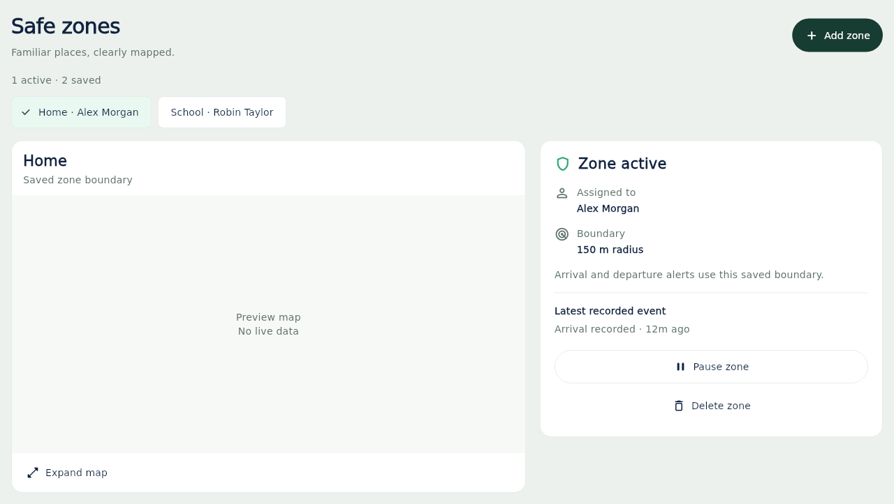

# Safe zones UI refinement

Safe zones previously displayed a painted grid and circle, with a decorative
wearer dot. The feature always showed the first zone and combined its name with
an aggregate status from all zones. That made both geography and alert context
unclear.

## What changes

- One real Google Maps view shows the selected zone's saved centre and exact
  radius over streets and landmarks. Only one preview map is mounted, rather
  than a map per saved-place card. The preview is not loaded while another
  primary tab is active. It reuses the existing Maps SDK and app setup;
  no Static Maps API or new key/dependency is needed.
- Expand map opens a read-only map with pan, zoom, recenter and satellite view.
  The compact preview leaves page scrolling intact. Controls have 48px targets.
- Saved places are selectable by document ID. Two places with the same name are
  no longer silently collapsed. Selection falls back when a selected place is
  removed.
- Active/paused describes the zone configuration. The assigned watch is labelled
  as an assignment, without claiming the wearer is currently inside the radius.
- The latest available arrival/departure record must match both the selected
  zone ID and watch IMEI. Records without a zone ID are not attributed to a place.
- Matching unresolved emergencies remain prominent, with a Review alerts action.
  They are not presented as proof of an emergency at the map position. Alert
  loading/failure has explicit copy.
- Pause/activate/delete use existing GeofenceService methods. Deletion asks for
  confirmation; repeated operations are guarded while pending, with success and
  failure feedback. Existing create and map-picker behavior is retained. The
  optional Wi-Fi name field no longer promises automatic inside detection.
- The layout stacks on phones and at enlarged text sizes, and uses map/details
  columns on wide screens. Navigation space remains reserved by HomeShell.

The map is a saved-boundary view, not a wearer tracker. Changing or zooming its
camera never writes a zone or moves the saved centre. Invalid coordinates and
radii have a fallback view; delayed map initialization exposes retry.

## Rendered layouts

These captures use a labelled test map; the running app uses real Google Maps.



[Phone layout](images/safe-zones/mobile.png) ·
[Dark phone layout](images/safe-zones/mobile_dark.png)

## Parallel service work

Audited all open draft service PRs #111–121 on 2026-09-11 against UI `ed5c3bf`.
None modifies Safe zones page/widgets/logic, the Geofence model, or the location
picker. #114/#119/#120 touch `guardian_services.dart` in other service classes;
GeofenceService methods are unchanged. #119 inserts ActivityService immediately
before GeofenceService, so retain both during future integration.

PR #116 at `89591de` adds validated Home Wi-Fi display to Device.mapDisplayLocation.
That overlay explicitly does not change geofence detection. This view displays
only stored zone geometry and does not duplicate or override that pilot logic.
The existing geofence, alert and authorization rules remain unchanged.

## Review and validation

Safe-zone geometry and widget tests cover radius fitting, malformed records,
responsive layouts, selection, operation callbacks, alert/event scoping and the
delete confirmation. Existing safe-zone logic tests run alongside dashboard,
login and navigation checks. Release gates run Flutter analysis, the full suite,
a web build, gateway tests and Firestore authorization checks.

Preview images render the actual overview with synthetic people/zones and a
clearly labelled test map. They do not simulate real Google imagery or establish
live map service availability. Production uses Google Maps; verify map tiles,
expanded gestures and device behavior in the normal app preview before merge.

To reproduce from `apps/mobile`:

```sh
flutter test test/safe_zone_map_test.dart test/safe_zones_overview_test.dart test/safe_zone_logic_test.dart
flutter test tool/render_safe_zones_previews_test.dart --dart-define=SAFE_ZONES_PREVIEWS=true
```
